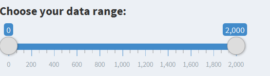
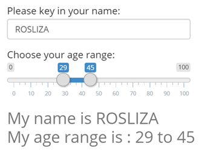
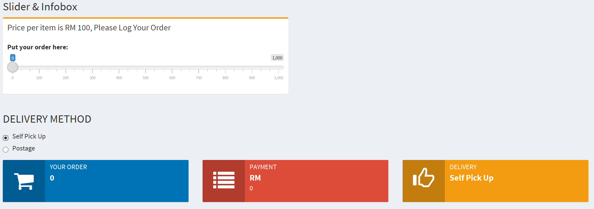

```{r setup, include=FALSE}
knitr::opts_chunk$set(echo = FALSE)
library(plotly)
```

## INTRODUCTION

This Application is develop using SHINY DASHBOARD.
Using this application user can learn how to used Slider with to control the size of dataset for the graph, using the slider as a data input.Data used in this assignment is Diamond dataset which built in in plotly library.

Main focus for this application are:

A: Using the slider to integrate with Scatter Plot Graph<br>
B: Using the slider to integrate with TextInput<br>
C: Using the slider to integrate with Infobox<br><br>

<b>USER GUIDE</b>

1. The Application consist of Side Panel and Main Panel Windows.The Side Panel Window, consist of 3 Menu
2. User can click for the interested menu in Side Panel Windol. In the Main Panel Window, there is a slider to control the size of the dataset or input text or infobox
3. In the main panel, user can adjust the slider the view the effect of the output


##A: SLIDER INTEGRATE WITH GRAPH
The Slider used to control the size of dataset for the plotting graph. 



```{r, echo=FALSE, message=FALSE, warning=FALSE}
            df <- diamonds[sample(1:nrow(diamonds), size =2000),]
            plot_ly(df, x = df$x, y = df$price, mode = "markers", color =                 
            
            df$cut,colors=c("pink","purple","red","blue"), size = df$z) %>%
            layout(title = "Diamonds")
```

table is used to view the diamond dataset
```{r, echo=FALSE, message=FALSE, warning=FALSE, results='asis'}
library(knitr)
kable(diamonds[1:5, ], caption = "Viewing Diamond Dataset")
```


##B: SLIDER INTEGRATE WITH TEXT INPUT

Text input and slider is used to capture the text.




##C: SLIDER INTEGRATE WITH INFOBOX

The slider and radio button used to capture text for infobox


